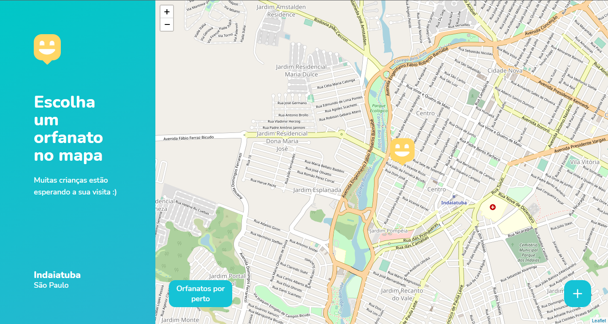
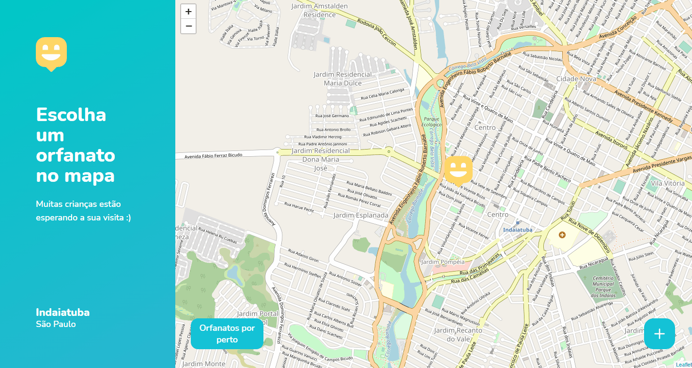

# Happy
 Find orphanages near you.

 
 
 
 <hr />

# :computer: Technologies
  - ReactJS
  - React Native
  - Express
  - SQLite
  - TypeORM
# 💿 How to use (web):
  ```bash
  # Make sure you have the backend running in your computer.
  # Clone this repository
  $ git clone https://github.com/EduardoBravoP/Happy-NLW3.git

  # Go into the repository
  $ cd Happy-NLW3
  
  # Go into the web folder
  $ cd web

  # Install dependencies
  $ yarn

  # Run the app (Web)
  $ yarn start
  ```
# 💿 How to use (mobile):
  ```bash
  # Make sure you have the backend running in your computer.
  # Clone this repository
  $ git clone https://github.com/EduardoBravoP/Happy-NLW3.git

  # Go into the repository
  $ cd Happy-NLW3
  
  # Go into the mobile folder
  $ cd mobile

  # Install dependencies
  $ yarn

  # Run the app (iOS)
  $ yarn ios

  # Run the app (Android)
  $ yarn android
  ```
# 💿 How to use (backend):
  ```bash
  # Clone this repository
  $ git clone <https://github.com/EduardoBravoP/Happy-NLW3.git>

  # Go into the repository
  $ cd Happy-NLW3

  # Go into the backend folder
  $ cd backend

  # Install dependencies
  $ yarn

  # Run the application in developer mode
  $ yarn dev

  # The server will start in port:3333
  ```
