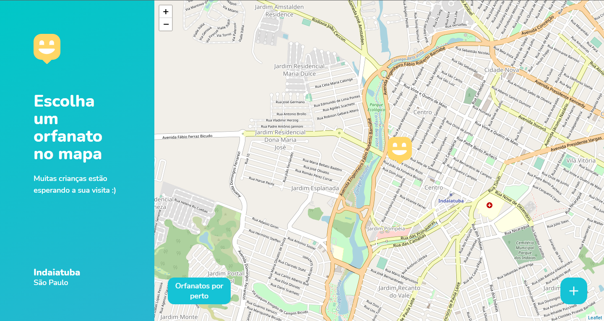
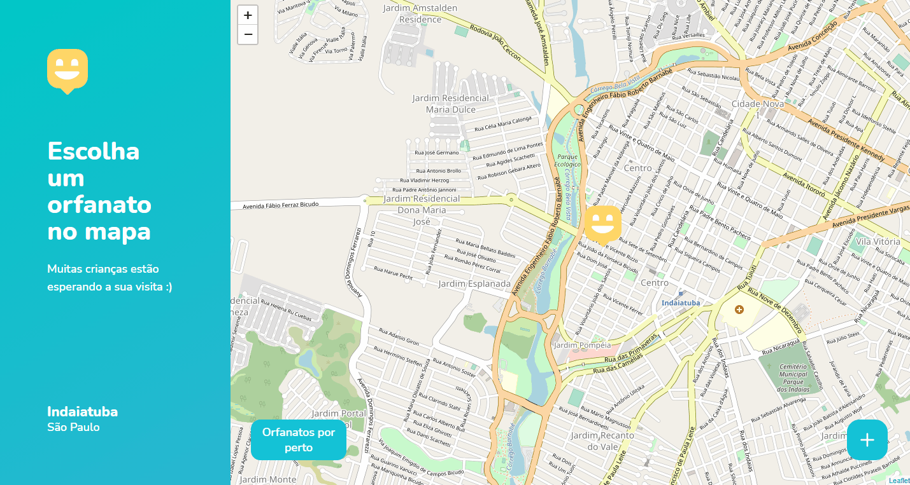
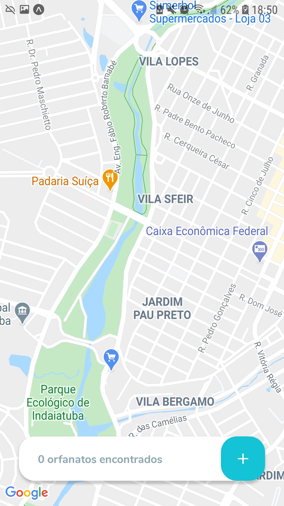
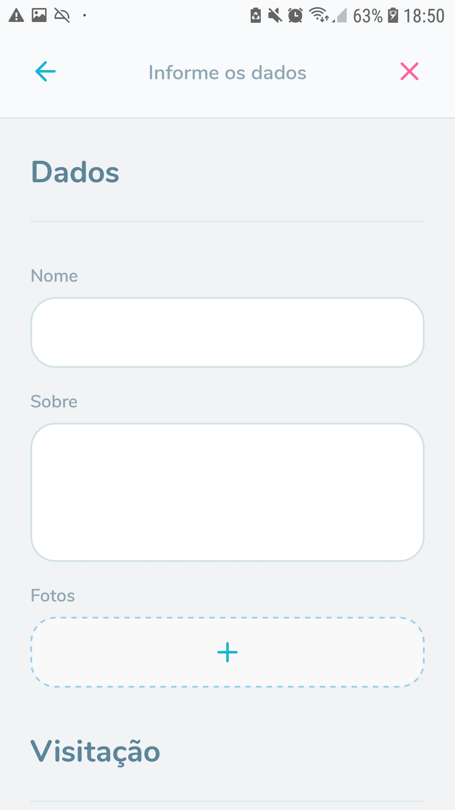
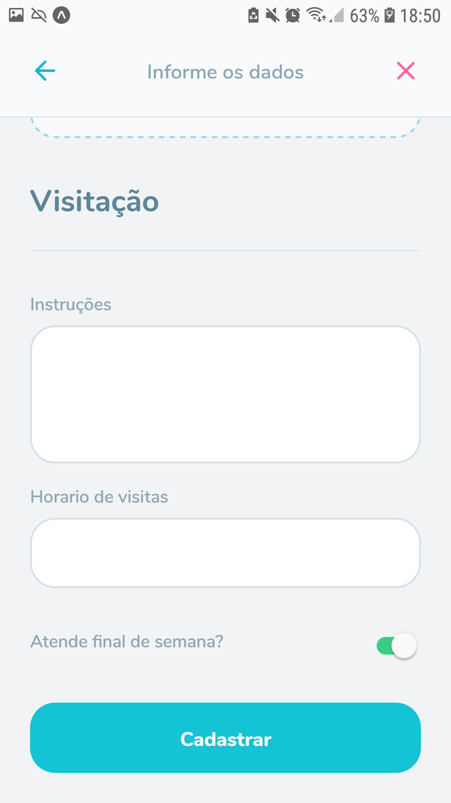

# Happy-NLW3
 Aplicativo Happy com uma feature a mais, desenvolvido durante o NLW3.

 
 
 
 
 
 
 
# :computer: Technologies
  - ReactJS
  - React Native
  - Express
  - SQLite
  - TypeORM
# :rocket: Features
  - Visualização de mapa utilizando o Leaflet;
  - Marcações no mapa;
  - Registros de orfanatos no banco de dados;
  - App Mobile e Desktop;
  - Bonus: Listar orfanatos a pelo menos 5km de distancia baseado na localização atual do dispositivo.
